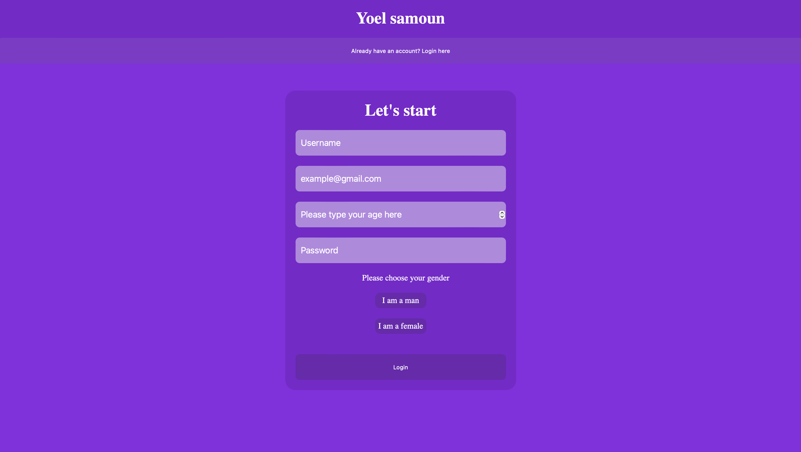
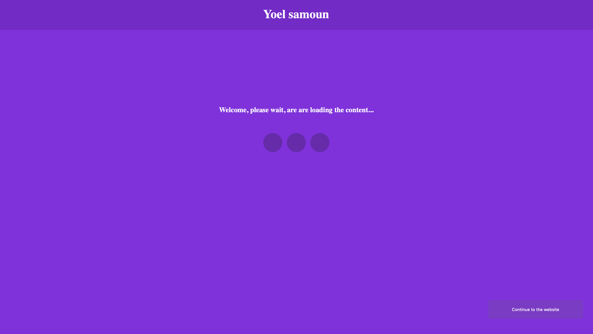
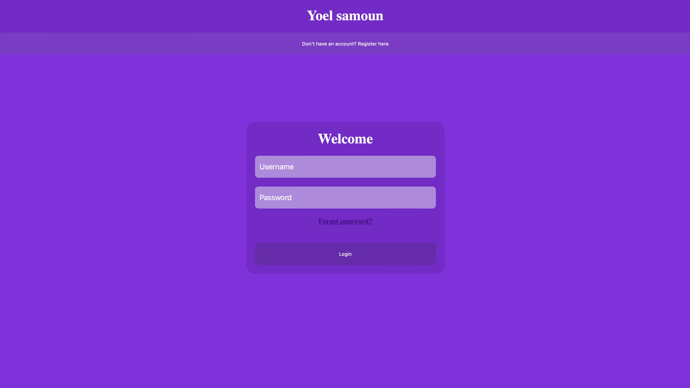
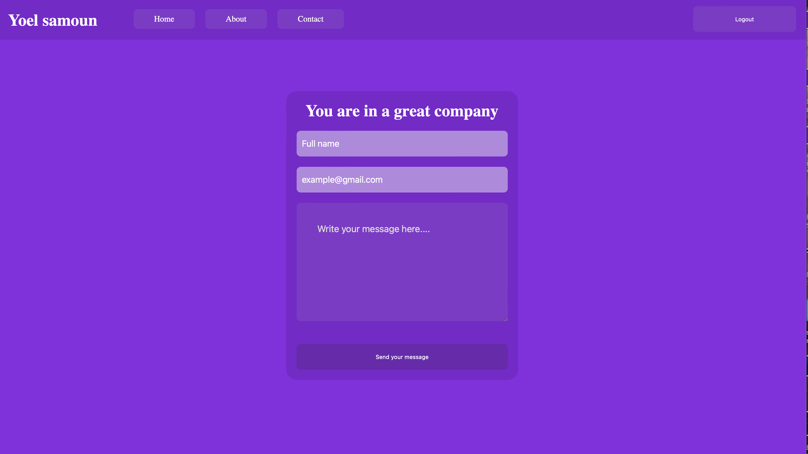

Website Project with HTML and CSS

This project is a simple website created using HTML and CSS, showcasing various features and animations. It includes dedicated pages for navigation, user authentication, and more.

Files Included:

	•	HTML Files:
	•	about.html: About page with detailed information.
	•	contact.html: Contact page for user inquiries.
	•	enter.html: Entry point for login or registration.

	•	home.html: Main homepage with an overview.
	•	login.html: Login page for user authentication.
	•	nav.html: Navigation bar structure.
	•	register.html: Registration page for new users.
	•	CSS Files

	•	about.css: Styles for the About page.
	•	contact.css: Styles for the Contact page.
	•	home.css: Homepage styling.
	•	loader.css: Loading animations.
	•	login.css: Styling for the Login page.
	•	nav.css: Navigation bar design.
	•	register.css: Registration page styles.

Key Features:

	•	Interactive design.
	•	Clean and structured code for scalability.
	•	CSS animations for a smooth user experience.

 

